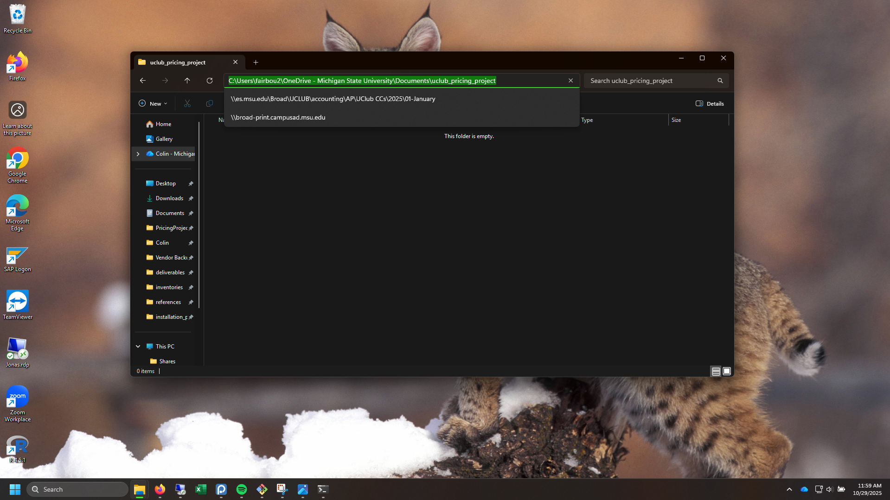
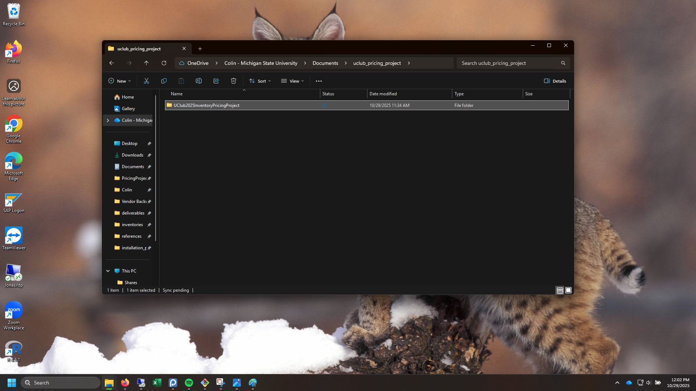
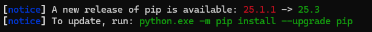
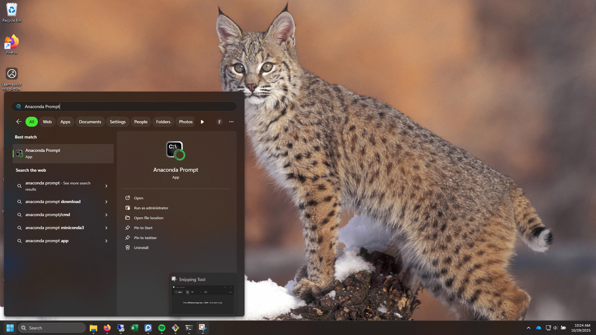
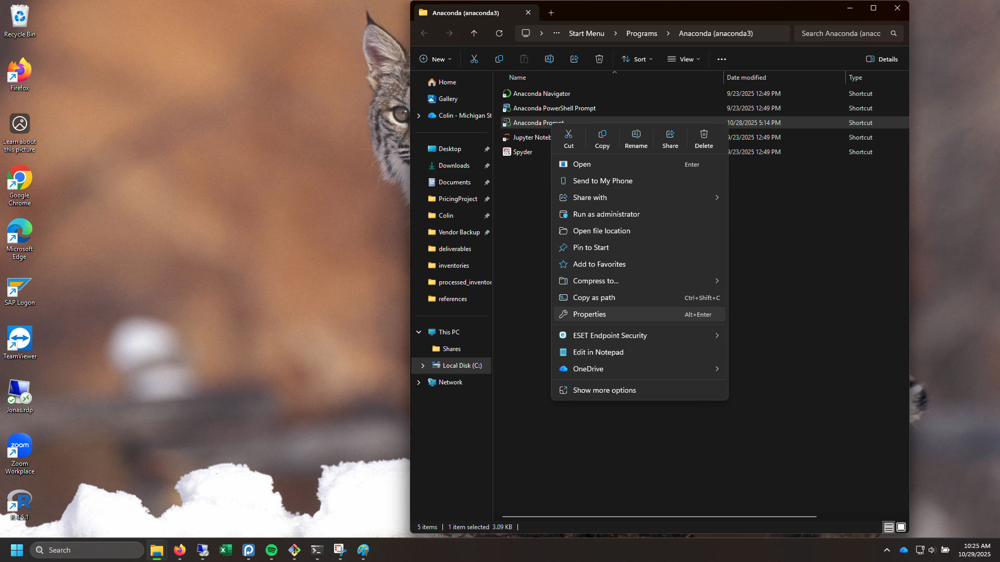
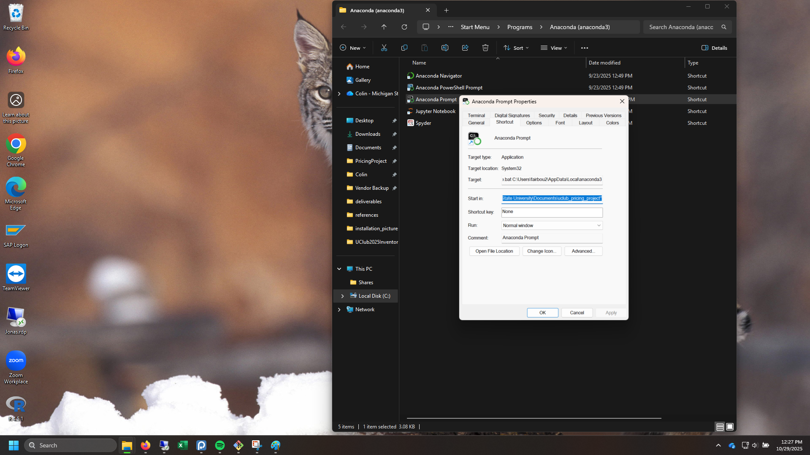
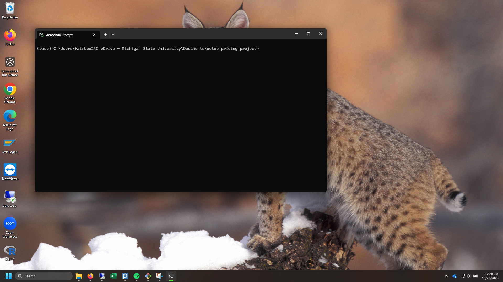

# Installation Instructions

This guide will walk you through the process of downloading the repository, setting up the environment, and running the test file.

## Step 0: Install Python onto your machine

If you already have **Anaconda** installed, you can skip to **Step 1.**

Otherwise, go to [Anaconda's Website](https://www.anaconda.com/download) to download the installer.

Scroll down to the bottom and click **Download Miniconda Installer**, underneath **Distribution Installers**, click *Download*.

Download the '.exe' file to your machine, and run it when it finishes downloading.

Follow the installation instructions. When there are 4 options to select from, make sure that both the **first** option to create shortcuts and the **third** option to register Anaconda3 as the default python 3.13 are checked, and click install. 

Follow the installation instructions until it is finished. Allow the Navigator to automatically open. If a browser window opens asking if you want to create an account, you do **NOT** need to create an account.

Scroll down to Anaconda Prompt, and select Launch.

In the prompt, enter this command:

```bash
conda --version
```

And then press enter. It should output:
```
conda 25.5.1
```

Then, enter this command:

```bash
python --version
```

And then press enter, and it should output:

```
python 3.13.5
```

You have now installed Python (the programming language) onto your machine. Please close out of Anaconda Prompt.

## Step 1: Download the Repository

First, you'll need to download the repository using Git. *Git* is a tool that tracks changes to files so people can work on projects together without losing or overwriting each other’s work. We are going to use it to download all of the files in this repository.

If you don't have Git installed, you can download it from [here](https://git-scm.com/). Look for 'Latest source Release' and a 'Download for Windows' button. At time of writing, it is a light blue (teal) box on the right side of the screen.

Once the '.exe' file is downloaded, run it to install *Git* onto your machine. During installation, do not change any of the default settings. 

Upon completion of install, open File Explorer, and navigate to your default 'Documents' folder, likely within your 'OneDrive - Michigan State University', and create an empty folder named 'uclub_pricing_project' and open it. Next, copy the path of the project folder from the top address bar.



Then, open a new Anaconda Prompt (you can press the Start button, search Anaconda Prompt, and it will show up), and enter this command:

```bash
cd (paste your copied path here using Shift + Insert)
```

And press enter 

... to look something like:

```bash
cd C:\Users\fairbou2\OneDrive - Michigan State University\Documents\uclub_pricing_project
```

There will be no output to this command, but you should notice that the leading text before your command line changes to include the path that you entered, like this:

```
(base) C:\Users\fairbou2\OneDrive - Michigan State University\Documents\uclub_pricing_project>
```

Then, within the same command prompt, run the following command to clone the repository:

```bash
git clone https://github.com/uclubacct/UClub2025InventoryPricingProject.git
```

This command will create a local copy of the repository on your machine within the project folder.



## Step 2: Prepare Environment and Install Packages

Next, we want to create an environment to enable users to keep all files, packages, and dependencies in one place. 

Run these two commands separately to create the virtual environment (venv).

```bash
python -m venv venv
```

This will have no output, but to make sure it works, run the following command to activate the virtual environment. **Note: Case Sensitive**

```bash
venv\Scripts\activate
```

There shouldn't be an output for this either, but it should again change the leading text before your command, like this:

```
(venv) (base) C:\Users\fairbou2\OneDrive - Michigan State University\Documents\uclub_pricing_project>
```

This means that the virtual environment is now active.

### Install packages

Now that your virtual environment is active, run the following command to install all of the required packages and dependencies to the environment:

```bash
pip install -r UClub2025InventoryPricingProject\requirements.txt 
```

This may take a brief moment to download all of the specific dependencies for each of the 11 packages. 

___
If it fails and prompts you further to update 'pip', Python's engine for installing verified coding packages:



Do so by running the command given:

```bash
python.exe -m pip install --upgrade pip
```

And then rerun the previous command:

```bash
pip install -r UClub2025InventoryPricingProject\requirements.txt 
```

___

There is a package named Tesseract that requires installation.

Go to [Tesseract's Github](https://github.com/UB-Mannheim/tesseract/wiki) and download the latest Tesseract installer for Windows. At time of writing, look for this link: [tesseract-ocr-w64-setup-5.5.0.20241111.exe (64 bit)]

Run the downloaded .exe file and follow through the default instructions.

___

## Step 3: Run the File

Once the environment is set up and the packages are installed, you can run the program to verify everything is set up correctly. Then, in the same terminal, run the test file using Python by entering this command:

```bash
python UClub2025InventoryPricingProject/master_program.py
```

This will execute the test script and display the progress. The results and outputs will be stored in the deliverables folder. 

___

# Complete!

That's it! You've successfully installed UClub2025InventoryPricingProject and run the test file. For ease in future use, complete the next step.

___
## Step 4: Customize Anaconda Prompt

Our goal is to force Anaconda Prompt, upon startup, to always open up to the 'uclub_pricing_project' where you can activate the virtual environment and run the file, instead of needing to navigate to that location every time.

Open the project file 'uclub_pricing_project' that contains the venv and github repo, and copy the address path at the top of the window again.

If Anaconda Prompt is open, close it. Press the start button, search for Anaconda Prompt, and click Open File Location.



Right click the Anaconda Prompt shortcut file and select Properties from among the options.



Within the "Start in:" box, paste the same address path as the 'uclub_pricing_project'



Click *Apply* and *Okay*.

Then open Anaconda Prompt, and the address at the top, on the first line, should show the file path to the your project file. Looking something like this:



From here, whenever you open Anaconda Prompt, it will default to opening to this location, reducing the number of commands that you have to run.

___

We can test this by closing out of the Anaconda Prompt, and then opening another instance. It should open up with this (or something like this) as the leading text.

```
(base) C:\Users\fairbou2\OneDrive - Michigan State University\Documents\uclub_pricing_project>
```

From here, we can run the two necessary commands. One to activate the virtual environment again.

```bash
venv\Scripts\activate
```

And then the command to run the program

```bash
python UClub2025InventoryPricingProject/master_program.py
```

___

If you encounter any issues during the installation process, feel free to reach out to me for assistance at [fairbou2@msu.edu](mailto:fairbou2@msu.edu).